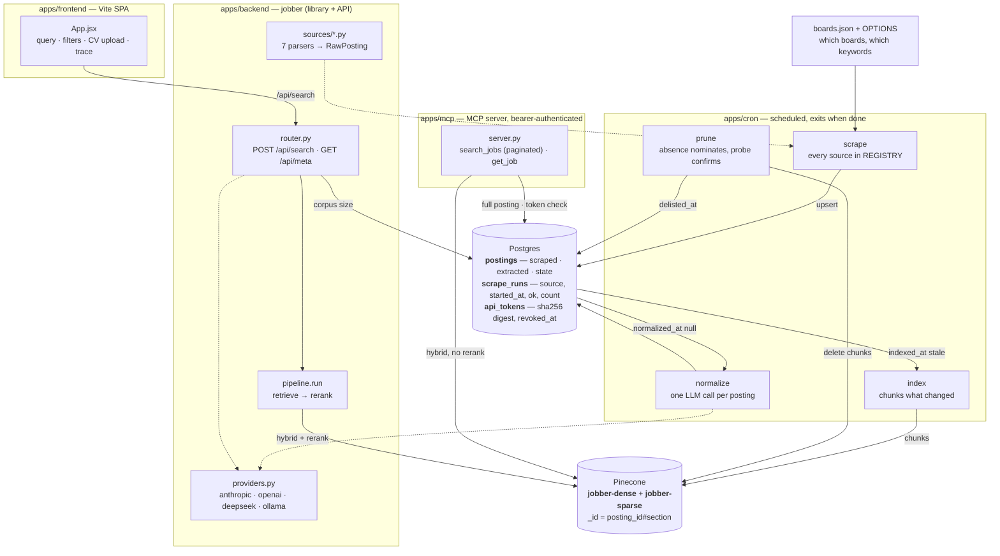

# Jobber.it

RAG pipeline over scraped job postings, searchable by free-text query or engineer profile.

**Stack:** Python 3.12 (uv), httpx + selectolax, Postgres, Pinecone, FastAPI, React + Vite + Tailwind.

## How it works



An LLM client reaches the same corpus through `apps/mcp` rather than the SPA's
endpoint. It skips both LLM-shaped steps the browser path needs: no query
rewrite, because the caller already writes structured queries, and no reranker,
because the caller reads every result and judges for itself.

## The model

One table, `postings`, holds both the corpus and the pipeline's state — which is what makes the crons incremental instead of a nightly full rebuild. Schema in [db/migrations/schema.py](apps/backend/jobber/db/migrations/schema.py); queries in [db/__init__.py](apps/backend/jobber/db/__init__.py).

| Group | Columns |
|---|---|
| identity | `id` (`source:source_id`), `source` |
| scraped | `url`, `title`, `company`, `description_text`, `location_raw`, `posted_at`, `extra` |
| extracted (LLM) | `seniority`, `years_required`, `remote_policy`, `location`, `salary_min`, `salary_max`, `stack[]`, `responsibilities_text`, `requirements_text` |
| state | `normalized_at`, `indexed_at`, `first_seen_at`, `last_seen_at`, `delisted_at` |

`api_tokens` is the third table: one row per MCP credential, holding a sha256 digest and a nullable `revoked_at`. `scrape_runs` records every scrape attempt (`ok`, `count`, `started_at`); prune measures candidacy against a source's last *successful* run, so one bad night for a board cannot look like thousands of delistings. A Pinecone record is `posting_id#section` over up to three sections — `requirements`, `responsibilities`, `description` — with the scalars carried as metadata so a result card renders without a second lookup.

`extra` also carries a `role` classified from the title ([sources/base.py](apps/backend/jobber/sources/base.py)), and `pending_normalize` requires it. That gate is what makes a wide board sweep affordable: an ATS board runs ~25% engineering, and the rest is roles the LLM would be paid to read.

## Quick start

Needs uv, Node 22, a Postgres URL and a Pinecone key.

```bash
cp .env.example .env    # DATABASE_URL, PINECONE_API_KEY, and the key for providers.DEFAULT
make install            # uv sync all three python apps + npm ci
make migrate            # create the schema (see Database below for an existing one)
make test               # parser, prune, normalize, auth and pagination — offline, no network
make serve              # search API on :3000
make mcp                # MCP server on :3001
make web                # vite on :5173, proxying /api to :3000 (same-origin, so no CORS)
```

`providers.DEFAULT` in [providers.py](apps/backend/jobber/providers.py) picks the LLM vendor for both ingestion and search. Its key is required at startup by the two entry points that actually call a model — the API and the normalize step — and by nothing else. `scrape`, `index`, `boards` and `prune` boot on [jobber_cron/config.py](apps/cron/jobber_cron/config.py), the MCP server on [jobber_mcp/config.py](apps/mcp/jobber_mcp/config.py) — each a `Config` declaring only the fields that app can actually use, so those services hold no vendor key at all. Switching vendors is an edit there, not a flag.

### Database

Alembic owns the schema. It used to be a `create table if not exists` string executed on every pool open; it is now [db/migrations/schema.py](apps/backend/jobber/db/migrations/schema.py) plus revisions, so a column change is a migration rather than an edit and a hope.

```bash
make migrate                    # fresh database: builds postings, scrape_runs, api_tokens
```

On a database that **already has** `postings` and `scrape_runs`, revision `0001` is a transcription of what is already there — record it as applied rather than running it:

```bash
make stamp                      # marks 0001 as applied without executing it
make migrate                    # now only 0002 runs, creating api_tokens
```

To confirm the models really do match a live database before trusting either, generate against it — an empty migration is the pass:

```bash
cd apps/backend && uv run alembic revision --autogenerate -m check
```

### MCP server

`apps/mcp` serves `search_jobs` (hybrid search, paginated, compact cards) and `get_job` (one posting in full) over Streamable HTTP at `/mcp`. Every request needs `Authorization: Bearer <token>`.

There is no endpoint that creates a token — that is the point. Mint one against whichever `DATABASE_URL` is in scope:

```bash
make token NAME=claude-desktop  # prints the token once; only its sha256 is stored
```

A lost token is re-minted, never recovered. Revoke by hand:

```sql
update api_tokens set revoked_at = now() where name = 'claude-desktop';
```

Ingestion is scheduled work, so it lives in `apps/cron` — the chain, or any step alone:

```bash
uv run --project apps/cron python -m jobber_cron.gather           # scrape → normalize → index
uv run --project apps/cron python -m jobber_cron.gather.scrape    # or one step at a time
uv run --project apps/cron python -m jobber_cron.prune --dry-run  # what would be delisted, and why
```

## Sources

Seven sources, no auth except LinkedIn's Apify token. Board lists live in `gather/boards.json`; everything else is [gather/sources.py](apps/cron/jobber_cron/gather/sources.py).

| Source | Access | Configured breadth |
|---|---|---|
| Greenhouse | public board JSON API | 59 boards |
| Ashby | public board JSON API | 51 boards |
| Lever | public board JSON API | 9 boards |
| Djinni | HTML list pages | 7 keywords × 5 pages |
| DOU | RSS feed | 7 categories |
| Jobico | XML aggregator feed | one feed |
| LinkedIn | Apify actor | one Europe-wide search, 500 results/run |

- **Greenhouse** — the HTML in the payload is double-escaped, so it is unescaped before being flattened to text.
- **Ashby** — `isListed: false` is skipped, and `includeCompensation` yields a salary summary string that is passed to the normalizer as a hint.
- **Lever** — a posting is split across `descriptionPlain`, repeated `lists` blocks and `additionalPlain`; the parser rejoins them.
- **Djinni** — descriptions are inlined in the list markup, so it is one request per page and no per-vacancy crawl. `keywords × max_pages` is a hard enumeration ceiling, so absence from a scrape is **not** authoritative. Timestamps are Europe/Kyiv local.
- **DOU** — RSS with full descriptions inline. `"Title в Company, location"` is split greedy-prefix-first so a title containing " в " survives. Rolling window, so absence is **not** authoritative either.
- **Jobico** — aggregator feed advertised in their `robots.txt` / `llms.txt`. **Attribution is required**: the original `url` is preserved on every posting and must be linked wherever one is displayed.
- **LinkedIn** — an Apify actor, billed per result: `limit_per_source × urls` is the per-run bill whether or not anything is new, and all search URLs go into one run because the actor also bills per start. Query params are stripped from the posting URL, since `refId`/`trackingId` would make the same posting look new every run. A closed posting never 404s — it answers `301 → …trk=expired_jd_redirect`, which is what prune reads.

Scraping stays polite and deterministic: per-source `delay`, an identifying User-Agent, retries only on 5xx/429, and only paths each site's `robots.txt` permits. Responses are cached to `data/cache` for reproducibility, not speed — the cache has no TTL, so `scrape()` hardcodes `cache=False` rather than take a flag that must never be omitted.

No ATS publishes a board directory (`/v1/boards`, `/v0/postings` and `/posting-api/job-board` answer 404, 404 and 401), so a board is found only by probing a candidate slug. Pipe candidates at the prober and it keeps the slugs that answer with postings:

```bash
uv run --project apps/cron python -m jobber_cron.gather.boards candidates.txt
```

Candidate quality is the whole game: a real slug list runs ~66% hits, while slugs derived from company names run ~3% and mostly land on a different company that took the same slug.

## Normalization — the one LLM step

Free-text postings become structured fields through one schema-validated call, across four interchangeable vendors ([providers.py](apps/backend/jobber/providers.py)). Vendor schema enforcement varies — Anthropic and OpenAI enforce server-side, DeepSeek offers JSON mode only — so **every response is validated client-side against the same Pydantic model regardless**: required for DeepSeek, and it makes the others fail loudly instead of silently.

The LLM only extracts what requires reading prose. `id`, `url`, `title`, `company` and `posted_at` are already known deterministically and are merged back in verbatim.

| Field | Notes |
|---|---|
| `seniority` | enum; the posting's own label where it gives one |
| `years_required` | the minimum of a range, `null` if unstated |
| `remote_policy` | `remote` only when fully remote — any office cadence is `hybrid` |
| `location` | normalized; `location_raw` is kept alongside |
| `salary_min` / `salary_max` | annualized gross USD (Djinni's "to $700"/mo → 8400) |
| `stack[]` | concrete technologies, canonical casing |
| `responsibilities_text` / `requirements_text` | **verbatim spans** — they become chunks, and paraphrase destroys the exact tokens the sparse vector matches on |

Each source's structured hints (Djinni's `meta_line`, Ashby's `salary_text`, Lever's `workplace_type`) are passed in as tiebreakers, and the prompt is told to trust them over the prose. `normalize` reports *verbatim fidelity* — a substring check of those two spans against the source text — which is the number to watch when changing vendor. Failures keep `normalized_at = null` and are retried next run.

### Cost to normalize the corpus

At ~4.4k postings — ~8.6M input / ~2.8M output tokens — there is a **34× spread** between cheapest and dearest, which is why the survivors were measured rather than picked. Kept as the record of why, not as a menu.

| Provider | Model | $/1M in | $/1M out | Schema | Corpus | Batched |
|---|---|---|---|---|---|---|
| deepseek | deepseek-v4-flash | $0.22 | $0.66 | no | $3.73 | — |
| openai | gpt-5.6-luna | $0.20 | $1.20 | yes | $5.07 | $2.53 |
| deepseek | deepseek-v4-pro | $0.435 | $0.87 | no | $6.17 | — |
| gemini | gemini-3.5-flash-lite | $0.30 | $2.50 | yes | $9.55 | $4.77 |
| gemini | gemini-3.7-flash | $0.75 | $3.75 | yes | $16.91 | $8.45 |
| gemini | gemini-3.6-flash | $0.75 | $3.75 | yes | $16.91 | $8.45 |
| anthropic | claude-haiku-4-5 | $1.00 | $5.00 | yes | $22.54 | $11.27 |
| openai | gpt-5.6-terra | $2.00 | $12.00 | yes | $50.65 | $25.33 |
| anthropic | claude-sonnet-5 | $3.00 | $15.00 | yes | $67.62 | $33.81 |
| anthropic | claude-opus-5 | $5.00 | $25.00 | yes | $112.70 | $56.35 |
| openai | gpt-5.6-sol | $5.00 | $30.00 | yes | $126.63 | $63.31 |

**Rates verified 2026-08-19 — a hand-checked snapshot, not live.** It will drift: DeepSeek moved to peak/off-peak billing on 2026-08-16 (these are off-peak; peak is roughly double), OpenAI cut prices on 2026-07-30, and Gemini Flash is on introductory pricing that doubles on 2027-01-01. None of the figures assume prompt caching, which every vendor offers on the stable system block. Re-check before trusting a number here.

Worth measuring specifically: Djinni, DOU and Jobico are heavily Ukrainian/Russian, and cheap models are least reliable exactly there.

## Search

```bash
curl -s localhost:3000/api/search -H 'content-type: application/json' \
  -d '{"query": "senior python, remote, kafka"}'
```

A query or a CV is first rewritten by an LLM into a **requirements block** — the shape a posting's requirements section has — plus its exact stack tokens. A CV embedded raw retrieves badly: it is a self-description matched against demands, and symmetry beats a raw embedding.

`retrieve → rerank`. Retrieval is hybrid over two indexes, since Pinecone's integrated embedding is per-index: `multilingual-e5-large` for semantics (a sizeable share of the corpus is Ukrainian/Russian) and `pinecone-sparse-english-v0` for exact tokens (NestJS, ClickHouse, k6 — latin-script even inside a UA/RU posting). Their scores are not comparable, so runs merge by **reciprocal rank fusion**, never by score. A `bge-reranker-v2-m3` cross-encoder then cuts the top 20 chunks to 5 postings, deduplicating *after* reranking so three sections of one posting cannot take three of the five slots. Chunks are structure-aware rather than fixed-size, because that is the boundary a query cares about — "5 years of Kubernetes" is a requirement, and a fixed window would cut it in half.

Filters are explicit UI controls, not parsed out of the query, and Pinecone applies them before scoring. Two traps they exist around: an unstated `years_required` is stored as `0` rather than omitted, since a `$lte` filter silently drops records lacking the field; `salary` has no such default, so `min_salary` is applied after the pipeline returns.

The SPA shows the retrieval trace, the query's tokens (tokenized the way the sparse side will, so `c++`, `c#` and `node.js` survive), and the filters that were applied — a hard filter removes matching jobs with no trace in the results. Profile upload is client-side: `File.text()` for `.txt`/`.md`, `pdfjs-dist` lazily imported for `.pdf`; a scanned PDF with no text layer is rejected by name rather than silently searched on an empty profile.

## Keeping it current

Two Railway cron services, split so **gather only ever adds and prune only ever removes**: a bug in the remover cannot corrupt ingestion, and a dead board cannot trigger deletions. `jobber_cron` imports `jobber`; nothing in `jobber` imports `jobber_cron`.

| Service | UTC | Command |
|---|---|---|
| `gather` | `0 3 * * *` | `python -m jobber_cron.gather` |
| `prune` | `0 5 * * *` | `python -m jobber_cron.prune` |

Each step selects only what changed, so a night that finds 50 new postings normalizes 50, not the corpus. Deleting is the dangerous half, so absence only *nominates*: sources whose scrape enumerates the whole board are authoritative, Djinni and DOU are not and get their nominees' URLs fetched to confirm, and LinkedIn ages out on the clock. Full reasoning, the three guards, and the resurrection path for a re-listed posting: [apps/cron](apps/cron/).

## Deploy

Five Railway services off four Dockerfiles: the API, the Caddy-fronted SPA, the MCP server, and one image running as both crons with different start commands. Build context is the repo root for `apps/backend`, `apps/cron` and `apps/mcp` (both of the latter path-depend on the backend), and `apps/frontend` for the SPA. Each Dockerfile's header comment carries the exact settings.

Variables differ per service, because only two entry points call a model:

| Service | Dockerfile | Variables |
|---|---|---|
| api | `apps/backend/Dockerfile` | `DATABASE_URL`, `PINECONE_API_KEY`, the `providers.DEFAULT` key |
| gather | `apps/cron/Dockerfile` | `DATABASE_URL`, `PINECONE_API_KEY`, the `providers.DEFAULT` key, `APIFY_TOKEN` |
| prune | `apps/cron/Dockerfile` | `DATABASE_URL`, `PINECONE_API_KEY` |
| mcp | `apps/mcp/Dockerfile` | `DATABASE_URL`, `PINECONE_API_KEY` |
| web | `apps/frontend/Dockerfile` | — |

`prune` and `mcp` carrying no vendor key is deliberate rather than an oversight: a credential a service cannot use is one it cannot leak.
